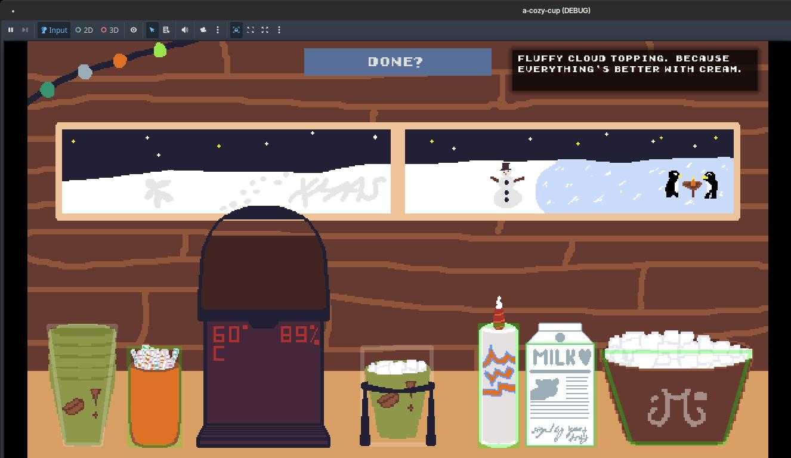
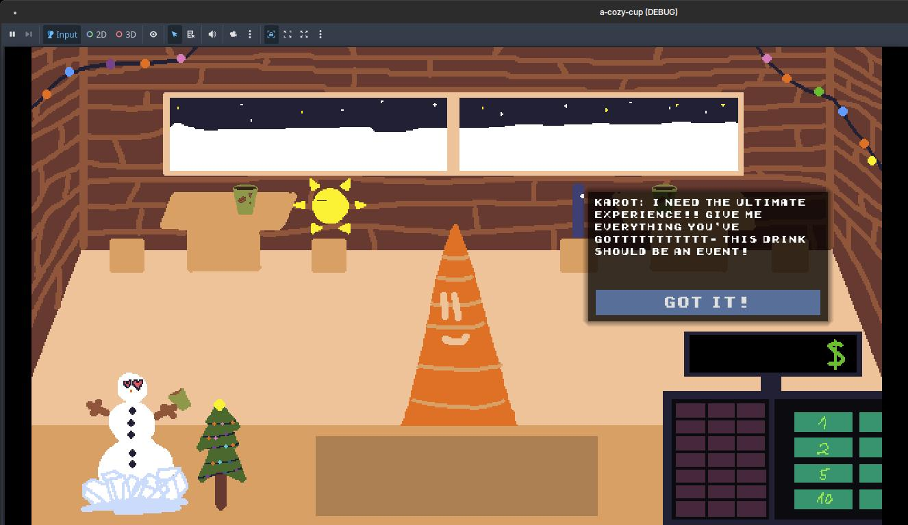
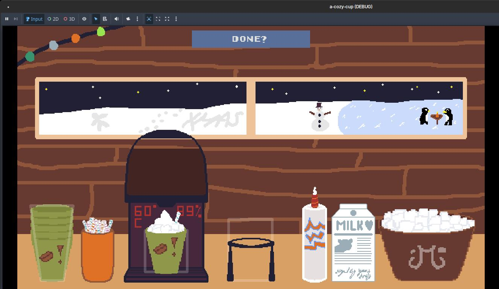

# a cozy cup:

A simple Godot experience that takes part in a cocoa shop on top of a mountain.
Weird people come to your store, though they are all nice to you.
No penalties, no pressure, just making warm drinks & vibes. Get
to know the strange & diverse individuals that the world has to offer.

Built in one day (13 hours) for Siege, a [Hack Club](https://hackclub.com) coding challenge.

*Yes, Visi is meant to be inVISIble :)*

## Tips

- If you mess an ingredient/topping up, just click on the cups and your old cup
will dispose automatically
- In case you want to explore more dialog paths, view the [script that has all dialogs](https://github.com/vempr/a-cozy-cup/blob/main/scripts/G.gd)

## Gallery

## Credits
- Font: https://www.dafont.com/early-gameboy.font
- BGM: https://www.youtube.com/watch?v=794ZbwO1vuI
- SFX from Pixabay
